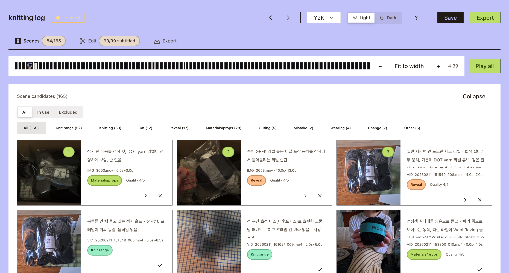

# cuesheet-pipeline

Vision-first rough-cut generation for dialogue-free footage — a cuesheet JSON contract, local
ffmpeg render, and natural-language editing via MCP.

## What it does



Point it at a folder of raw footage and it takes you through three steps:

1. **Scenes** — a vision model (Claude) looks at extracted frames and proposes moment
   candidates: which parts of the footage are worth using, and why.
2. **Edit** — refine the auto-generated rough cut in a browser editor (cut list, mini
   timeline, live preview, title cards, fade/dip transitions, BGM ducking under narration,
   one-click frame capture for thumbnails) or by telling your own Claude Code session what
   to change (it edits the same cuesheet file through an MCP bridge — no extra API cost).
3. **Export** — render straight to a final `.mp4` (and `.srt`) with local ffmpeg, no
   upload, no cloud step.

```
footage folder (no dialogue, visual-only)
      |
      v
  scan -> vision judgment -> assemble -> validated cuesheet (JSON)
      |
      +--> web editor (Scenes -> Edit -> Export)
      +--> MCP bridge (natural-language edits from Claude Code)
      v
  render (ffmpeg) --> final .mp4 + .srt
```

The cuesheet is the single source of truth: the web editor and Claude Code both read and
write the same validated JSON, so hand edits and natural-language commands never conflict.
See [ARCHITECTURE.md](docs/ARCHITECTURE.md) for the full package/data-flow map.

## Prerequisites

- Node.js >= 20, pnpm >= 11 (the repo pins an exact version via `packageManager` in
  `package.json` — run `corepack enable` once so `pnpm` resolves to that version).
- ffmpeg on `PATH`. On macOS, the default Homebrew `ffmpeg` formula is missing
  `drawtext` (no libfreetype/fontconfig support), which subtitle burn-in needs —
  install `brew install ffmpeg-full` instead and put it first on `PATH`. See
  [packages/render/README.md](packages/render/README.md) for the exact command.
  Cuesheets with no subtitles render fine with the plain `ffmpeg` formula.

## Quickstart

```bash
pnpm install
pnpm -r build                         # also needed once before opening Claude Code,
                                       # so the MCP bridge (cuesheet-bridge) has a dist to run
pnpm episode "<raw footage folder>"   # scan + vision draft, then launches the editor
```

Or from Claude Code, run `/episode <raw footage folder>` to generate the rough cut, then
open the editor at `localhost:5173` to polish and export.

No footage on hand yet? `bash scripts/generate-sample-clips.sh` generates a couple of
synthetic test clips (ffmpeg testsrc/color bars + tone, no copyright concerns) into
`media/clips/` so you can try the pipeline end to end.

## Why this exists

Most transcript-driven editors (Descript and similar tools) assume a spoken transcript to
align against. This tool is built for footage that has **no dialogue** — think a knitting
vlog, where the script is written separately and matching a script line to a clip is a
visual judgment ("does this look like what the line describes"), not an audio-alignment
problem. Two things follow from that:

- **Face-safe by design** — the vision pass judges face exposure per clip against a
  fixed policy (chin-line and above stays out of frame) and flags or crops accordingly,
  rather than leaving it to a human to catch on review.
- **Personal editing grammar as config** — cut rhythm, shot vocabulary, and narrative
  structure are reverse-engineered from the user's own past edits and encoded as
  overridable defaults in the assembly step, not a one-size-fits-all template.

It deliberately does not chase general-purpose NLE features (multitrack, effects,
template marketplaces) — the scope is draft automation plus a touch-up editor.

## Development

```bash
pnpm -r build      # build everything
pnpm -r typecheck  # type check
pnpm -r test       # tests
```

### Testing

Three layers, from fastest/narrowest to slowest/broadest:

1. **Unit tests** (jsdom) — `pnpm --filter @cuesheet/web test`, plus `pnpm -r test` for every
   package. The default for component/hook/logic tests.
2. **Vitest Browser Mode** (real Chromium, opt-in) — `pnpm --filter @cuesheet/web test:browser`.
   Reach for this only where jsdom genuinely can't exercise the behavior (real layout/animation
   timing, real `<input>` focus/selection/typing) — new tests opt in per file via
   `*.browser.test.tsx`; everything else stays on the faster jsdom suite.
3. **E2E smoke suite** (Playwright, full app) — `pnpm e2e` (or `pnpm e2e:ui` for the interactive
   UI). Runs the web app's own dev server against a small fixture cuesheet on its own port, and
   drives a handful of full user journeys (edit a cut, add a BGM track, export, etc.). See
   [tests/e2e/README.md](tests/e2e/README.md).

Tests always select by `data-testid` or ARIA role, never by class name (a styling refactor can
rename or drop a class without warning; see CLAUDE.md's testing section for the incident that
motivated this and one Astryx-component caveat).

## Docs

- [ARCHITECTURE.md](docs/ARCHITECTURE.md) — package map, data flow, dependency graph, key design decisions.
- [docs/PRD.md](./docs/PRD.md) — product requirements: north star, user scenario, full feature list.
- [docs/screen-spec.md](./docs/screen-spec.md) — canonical screen layout for the editor.
- [GitHub wiki](https://github.com/let-sunny/cuesheet-pipeline/wiki) — experiment reports: editing-grammar
  reverse-engineering, scene-detection measurement (and why it was rejected), rough-cut pipeline
  iterations.
